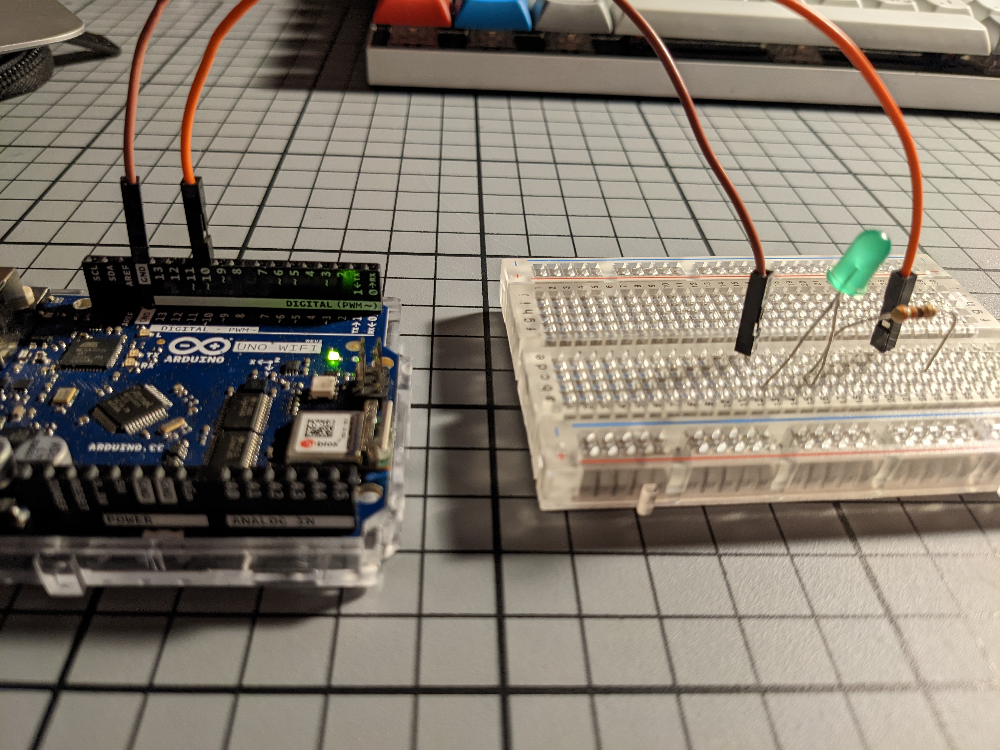

# MB_Documentation_Physical_Computing

22.10.18 D

As I do not have access to the IAD Wi-Fi and shiftr server at this point in time, and as I did not complete the exercise while in class, I sadly can't provide a screenshot. It would work like this in theory.

Photo:

