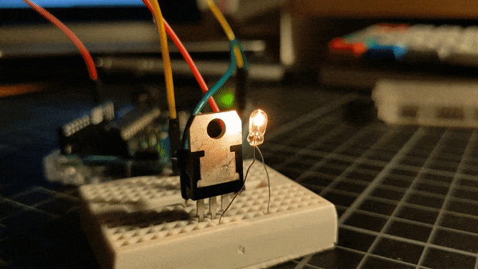

Welcome to my Physical Computing documentation :-)

As you can see, I made a folder for each individual exercise. You will find the corresponding code, images, and schematics there. Please consult the READMEs in each folder for easier image viewing.
For chronology's sake, I used the YY/MM/DD format in my folder structure.

2022 ZHdK Interaction Design 
Module: Physical Computing HS 2022 
Student: Mo Bünzli 
Mentors: Luke Franzke, Paulina Zybinska 

